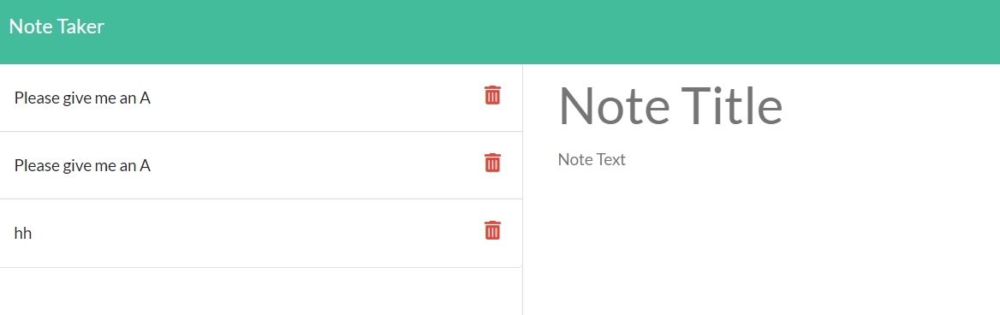

# Zachary's Note Taker

## Table of Contents
-[Description](#description)
-[Screenshot](#screenshot)
-[Installation](#installation)
-[Usage](#usage)
-[Credits](#credits)

## Description

A note taking app that can save your notes and your titles with unique IDs.

## Screenshot

## Installation instructions

You must run Node.js on the server.js

## Usage 

* click on notes to be directed to the notes page
* you may add an title and a notes section and save it 

## Credits

I worked on the project alone with tutoring from TA Jee - thanks Jee!
